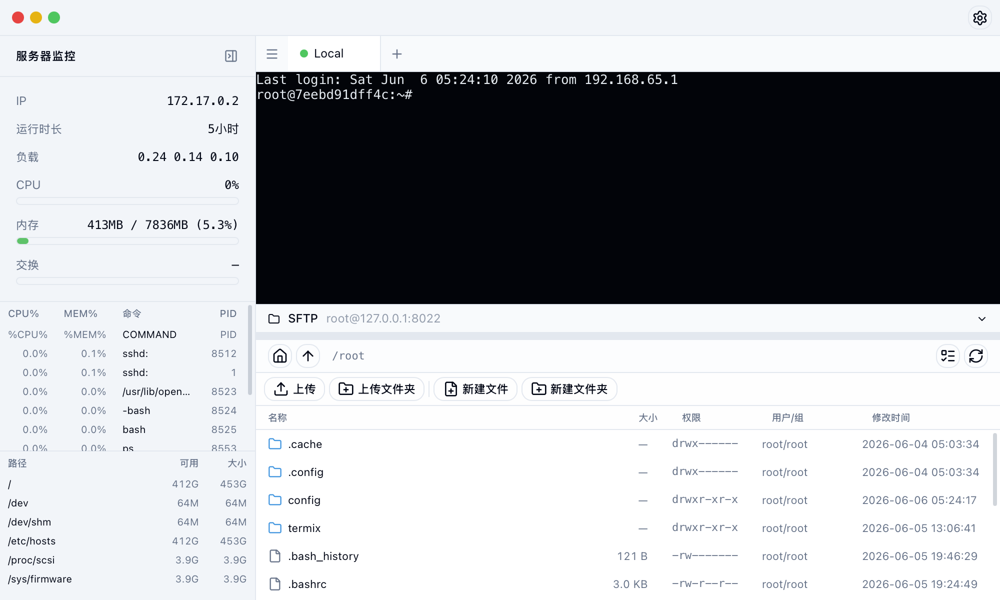
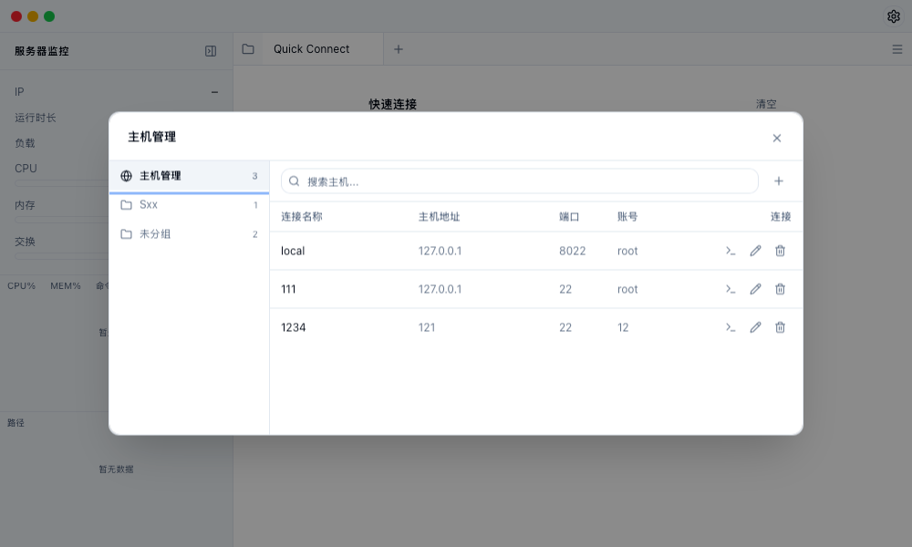
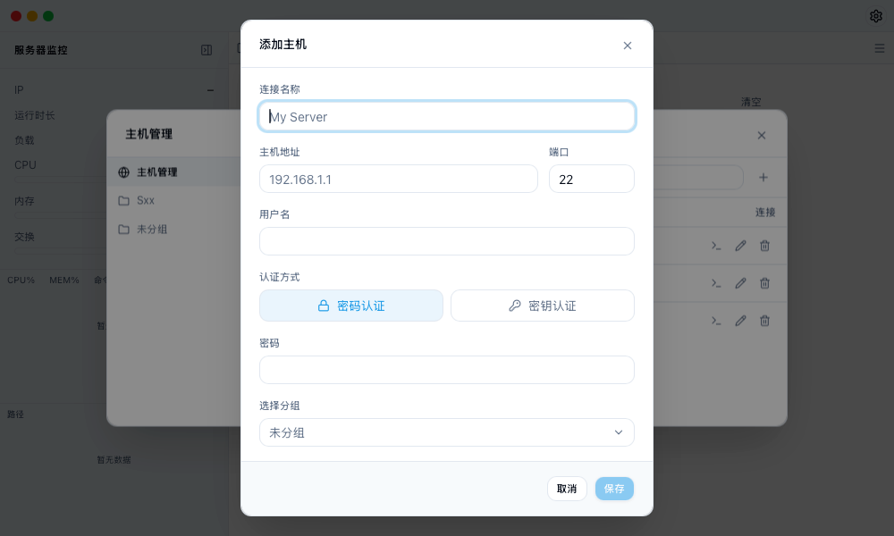
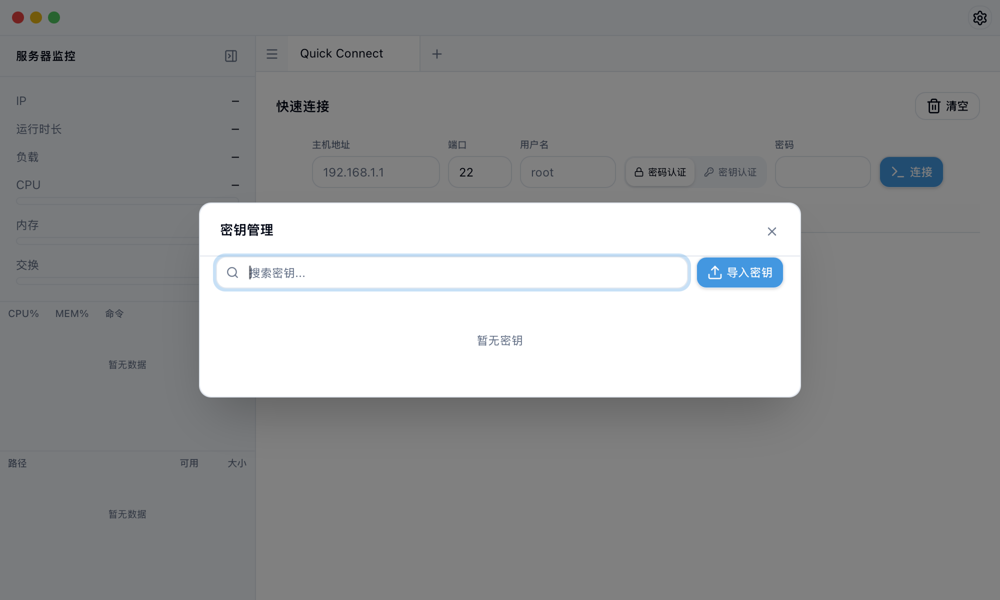
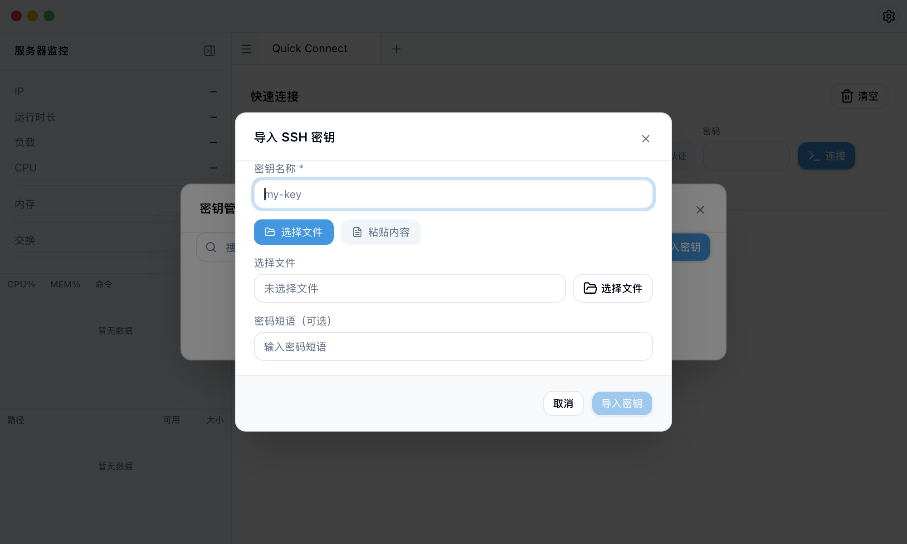

# VibeShell

基于 [Tauri 2](https://v2.tauri.app) 开发的跨平台 SSH 终端客户端。
集成主机管理、SSH 连接、服务器监控和文件传输功能。

## 功能特性

- **SSH 终端** — 支持密码和密钥认证连接远程服务器
- **标签页与分屏** — 多会话标签页和分屏视图
- **主机管理** — 分组管理服务器，保存连接凭据
- **SFTP 文件管理** — 浏览、上传、下载、拖拽上传、编辑和管理远程文件
- **服务器监控** — 实时 CPU、内存、磁盘和进程概览
- **密钥链** — 导入和管理 SSH 私钥
- **快速连接** — 临时连接无需保存主机
- **主题切换** — 深色和浅色模式
- **国际化** — 支持英文和中文界面

## 界面预览

<p><strong>SSH 连接</strong></p>
<p>支持密码和密钥认证，可选择记住密码，快速连接远程服务器。</p>


<p><strong>主机管理</strong></p>
<p>分组管理服务器主机，保存连接凭据，双击即可快速连接。</p>


<p><strong>添加主机</strong></p>
<p>填写主机信息包括名称、地址、端口、用户名和认证方式。</p>


<p><strong>密钥管理</strong></p>
<p>统一管理 SSH 私钥，导入后可在连接时选择使用。</p>


<p><strong>添加密钥</strong></p>
<p>支持从文件导入私钥，或粘贴已有私钥内容。</p>


## 下载

预编译安装包请前往 [Releases](https://github.com/chihqiang/VibeShell/releases) 页面下载。

| 平台   | 架构        | 格式 |
| ------ | ----------- | ---- |
| macOS  | Intel & ARM | .dmg |

## 快速开始

1. 从 [Releases](https://github.com/chihqiang/VibeShell/releases) 下载对应平台的安装包。
2. 安装并启动 VibeShell。
3. 点击 **添加主机** 保存服务器，或使用 **快速连接** 临时连接。
4. 双击主机或输入凭据，即可打开终端会话。

## 开发

```bash
# 安装依赖
npm install

# 启动开发
npm run tauri dev

# 构建
npm run tauri build
```

## 贡献指南

欢迎提交 Pull Request 或创建 Issue。

### 开发环境

- Node.js 20+
- Rust 1.95+
- npm 10.8+

### 开发流程

1. Fork 本仓库并克隆到本地
2. 运行 `npm install` 安装依赖
3. 创建功能分支：`git checkout -b feature/xxx`
4. 开发完成后提交代码
5. 推送到远程并创建 Pull Request

### 代码规范

- 前端：遵循 ESLint 和 Prettier 配置
- 后端：遵循 `cargo fmt` 格式化
- 提交信息：使用清晰的提交描述

## 许可证

[Apache 2.0](LICENSE)
